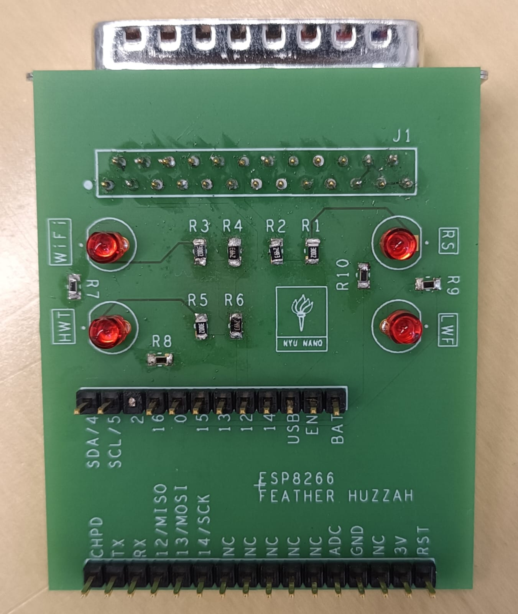
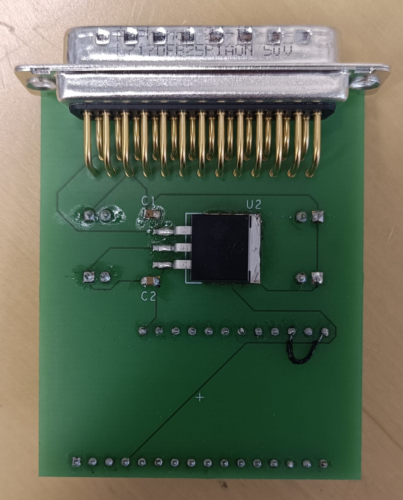
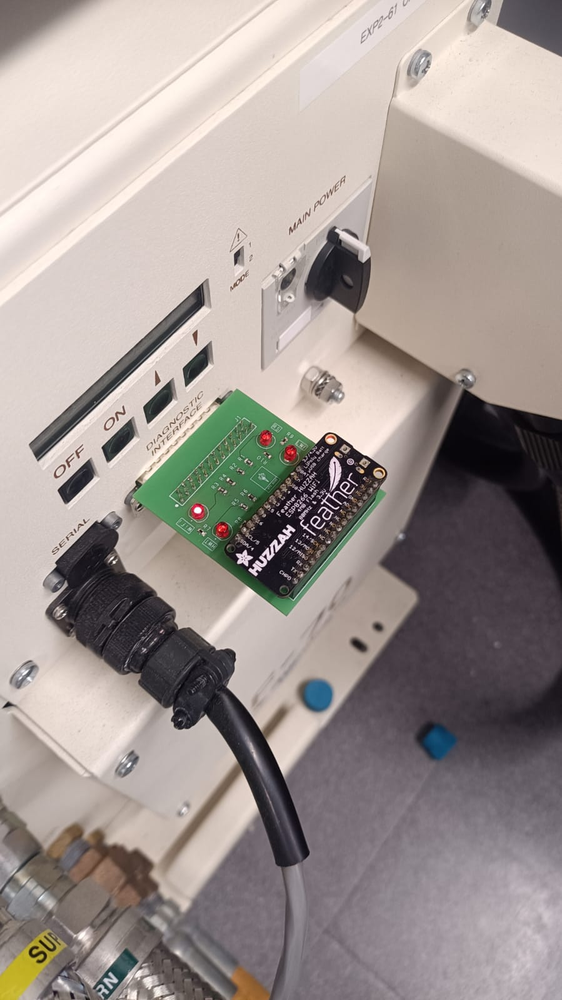

# CompressorStateMonitor

This repository contains the code and documentation for a standalone device designed to monitor the state of a compressor system. The device is capable of detecting errors such as high water temperature, low water flow, and the system's running status.

## Features

- Notifies lab authorities via email if any of the status signals are up, indicating a problem.
- LED indicators on the device board show the status of each condition: 
  - LWF (Low Water Flow)
  - RS (Running Status)
  - HWT (High Water Temperature)
  - WiFi LED (Indicates internet connection status)
- The device connects to a nearby hotspot to access the internet for sending emails.
- Utilizes an ESP8266 Feather board for connectivity.

The manufactured board is displayed below.

  
  

  <em>a): Board Top View</em> &emsp; <em>b): Board Bottom View</em>

The device in operation connected to the Compressor is displayed below,

  

